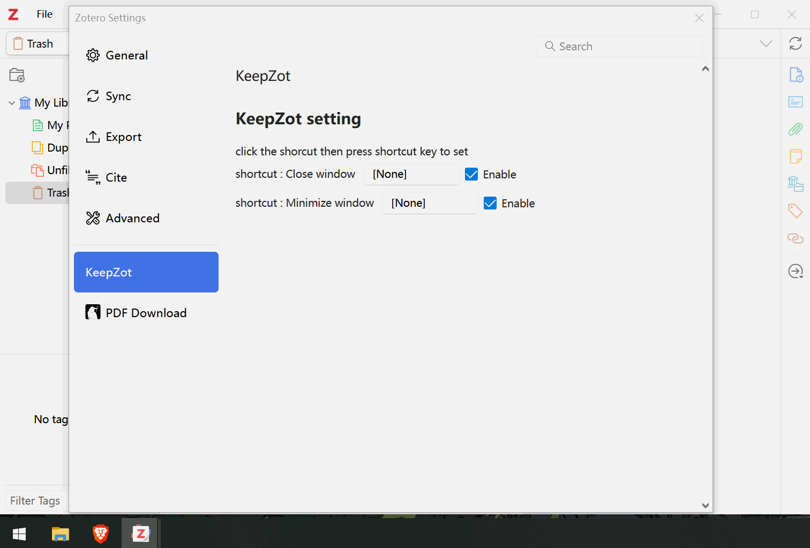

## Zotero minimize to taskbar

 KeepZot is another [keepzotero](https://github.com/yhmtsai/KeepZotero) of zotero 7
 Minimize Zotero to taskbar

# KeepZot 
almost same as keepzotero but some different
- Custom the minimize and close shortcut

# Installation
1. Download the *.xpi from Release
2. Start Zotero: Tools -> Add-ons
3. select "Install Add-on From File..." from the wheel on top right corner
4. choose the xpi file

# Settings
Custom shortcut is not set default and disable, you should set it if you need

# Acknowledgment
As a total newbie , i referred to following project.
- Thanks to [KeepZotero](https://github.com/yhmtsai/KeepZotero).
- Thanks to [zotero-plugin-template](https://github.com/windingwind/zotero-plugin-template).
- Thanks to [zotero-actions-tags](https://github.com/windingwind/zotero-actions-tags).

# Disclaimer
Use this code under AGPL. No warranties are provided. Keep the laws of your locality in mind!